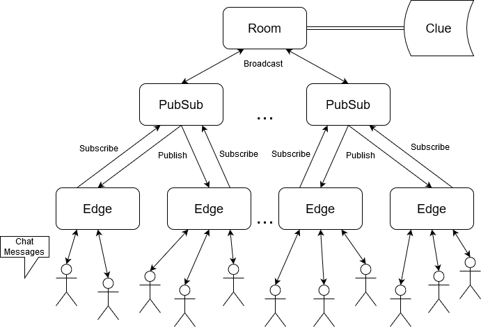

# Twitch Chat Lite

## Overview
Twitch Chat is the online videogame live streaming phenomenon where thousands of viewers from around the globe gather to comment and express themselves in creative ways on twitch.tv. Twitch Chat presents a novel distributed networking challenge which connects users into unique chat rooms all while providing a consistent view of the dialog to everyone involved.  Specifically, Twitch Chat relies on a “PubSub” architecture which load balances and processes all incoming messages reliably in order to convert them into richer text (i.e. recognizing and modifying emotes), apply chat room rules to every user (such as which stream the chat is under and who may be banned from speaking in the chat), and apply other relevant business logic to the dialog. The architecture gets its name from the “subscribers” who receive a consistent view of the dialog and “publishers” who manage a majority of the processing and logic to make Twitch Chat scale and run effectively. 

## Twitch Chat Lite
Twitch Chat Lite presents a robust, Java-based prototype mimicking the architecture of Twitch Chat.  The program operates under the same abstraction - separating clients from regional Edges which distribute messages up through PubSubs to reach the centralized Room.  This prototype provides the same ability to fan messages out after processing them using Clue-based logic at the Room to provide a consistent view to all distributed end users.

## Architecture
A more detailed description of Twitch Chat architecture can be found here: https://medium.com/twitch-engineering/twitch-engineering-an-introduction-and-overview-36ceeb8875de

For convenience, the portions of this architecture that are relevant (and modified slightly) to Twitch Chat Lite are included below:
* Edge — Receives and distributes messages between clients and backend services. Edge speaks a modified IRC protocol over TCP.

* PubSub — Distributes messages internally across Edge nodes. PubSub and Edge combine to form a hierarchical message distribution system which executes massive fanout.

* Clue — Perform analysis on user actions and send them through our business logic pipeline. Is the user banned in the channel they’re speaking in? Are they a moderator? To inform these decisions, Clue maintains data aggregated from PubSubs.

* Room — Responsible for the viewer list. Room aggregates and stores membership data across all PubSubs to retrieve viewer lists for each channel’s chat room.

In addition to these core backend architectural components, Twitch Chat Lite also includes a Client application.  This command-line application provides an interface for users to register themselves and join chat rooms associated with particular channels.  Chat rooms are kept distinct from one another and distributed across all other members currently in the channels.

Twitch Chat Architecture

## Usage
The "run" script provided allows the architectural components of Twitch Chat Lite to be deployed easily and in arbitrary order.

To execute the script use the following:

"./run \<arg>"

The valid arguments following "run" include:

* "room" - Launches Twitch Chat Room server on this host (with logging)
* "pubsub" - Launches Twitch Chat PubSub server on this host (with 
logging)
* "edge" - Launches Twitch Chat Edge server on this host (with logging)
* "client" - Runs the main client-side chat application which connects to Twitch Chat network

* "local" - Launches entire Twitch Chat network and client application locally on this host

Twitch Chat Lite supports basic moderator functionality for members currently in the chat room.  The list of commands includes:

* "/ban \<user>" - Bans the specified user in the chat room
* "/unban \<user>" - Unbans the specified user in the chat room
* "/mod \<user>" - Promotes the specified user to a moderator in the chat room
* "/unmod \<user>" - Demotes the specified user to no longer be a moderator in the chat room

In addition to these moderator commands, any user can leave a chat room and join a different channel by simply typing the command: "/leave"

*Note that Twitch Chat Lite deploys the Room, PubSubs, and Edges to static hosts.  These hosts are defined and can be expanded in the configuration file found under: src/config/Config.java*

## Assumptions
Twitch Chat Lite assumes that all users in the program have unique usernames.  In actual Twitch Chat, users are authenticated using OAuth which is responsible for allocating user identifiers as well.  For this reason, since Twitch Chat Lite requires no authentication service to demonstrate the chat functionality, it assumes that some separate authentication service would guarantee that users are unique.

Additionally, Twitch Chat Lite assumes that all Edge, PubSub, and Room servers are fault-tolerant.  In actual Twitch Chat, this is most likely the case since providing regional service requires that these hosts are kept live at all times.  Therefore, even though Twitch Chat Lite does not deploy an actual replicated state machine for each component, it is safe to assume that these hosts would be replicated and would not abruptly fail.

Note that when a new channel is joined for the first time, it is assumed that the "broadcaster" of this channel (aka the user whose name is also the channel name) is the only moderator.